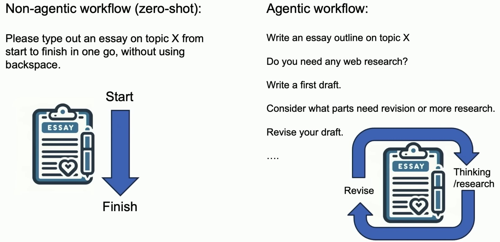
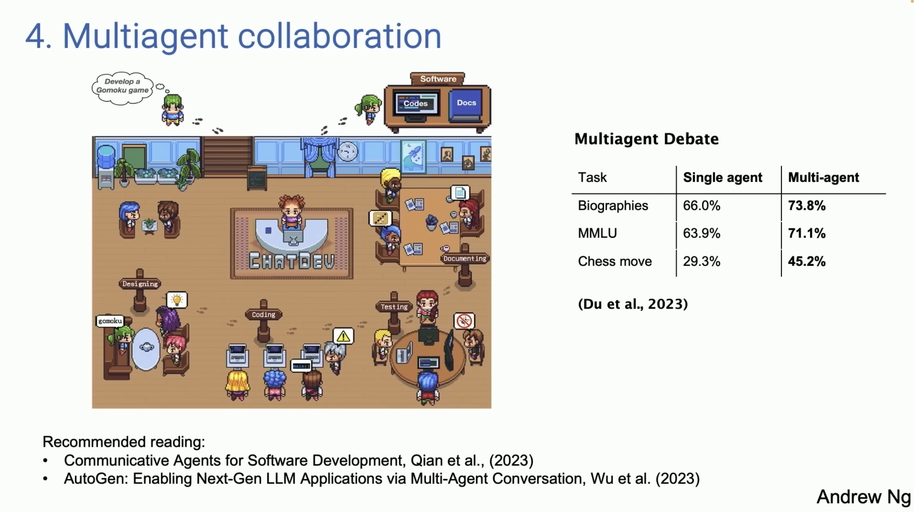

# What's next for AI agentic workflows - Andrew Ng

Here are some notes based on this [video](https://www.youtube.com/watch?v=sal78ACtGTc&t=4s&ab_channel=SequoiaCapital). 

slide 1:

* Agentic workflows are iterative which involves some thinking and revising. 

slide 2:

* Example of HumanEval benchmark, by openai - [[github](https://github.com/openai/human-eval)] - released 2021

slide 3:

* Performance of gpt3.5 and gpt-4 on HumanEval benchmark in Zero shot and Agentic settings.

slide 4:

* Let's explore these 4 design patterns

slide 5:

* Ask the LLM-itself to critic itself.
* Recommended read: 
    - Self-Refine: Iterative Refinement with Self-Feedback, Maddan et al. (2023) - [[paper](https://arxiv.org/abs/2303.17651)]
    - Reflexion: Language Agents with Verbal Reinforcement Learning, Shinn et al. (2023) - [[paper](https://arxiv.org/abs/2303.11366)]

slide 6:

* Ask another agent to Critic the first Agent results.

slide 7:

slide 8:

slide 9:

slide 10:
Agentic Reasoning Design Patterns
1. Reflection
    * Self-Refine: Iterative Refinement with Self-Feedback, Madaan et al. (2023)
    * eflexion: Language Agents with Verbal Reinforcement Learning, Shinn et al., (2023)
2. Tool use
    * Gorilla: Large Language Model Connected with Massive APls, Patil et al. (2023)
    * MM-REACT: Prompting ChatGPT for Multimodal Reasoning and Action, Yang et al. (2023)
3. Planning
    * Chain-of-Thought Prompting Elicits Reasoning in Large Language Models, Wei et al., (2022)
    * HuggingGPT: Solving Al Tasks with ChatGPT and its Friends in Hugging Face, Shen et al. (2023)
4. Multi-agent collaboration
    * ommunicative Agents for Software Development, Qian et al., (2023)
    * AutoGen: Enabling Next-Gen LLM Applications via Multi-Agent Conversation, Wu et al.

slide 11:
