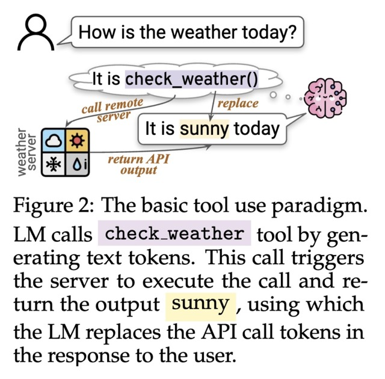

# CMU Advanced NLP Fall 2024 by [Graham Neubig](https://www.linkedin.com/in/graham-neubig-10b41616b/) - [[Youtube Playlist](https://www.youtube.com/playlist?list=PL8PYTP1V4I8D4BeyjwWczukWq9d8PNyZp)]

## 15 - Tool Use and LLM Agent Basics 
- [Youtube](https://www.youtube.com/watch?v=a3SjRsqV9ZA&t=11s&ab_channel=GrahamNeubig)
- [slides](https://www.phontron.com/class/anlp-fall2024/assets/slides/anlp-15-tooluse-agentbasics.pdf)
    - Agent definition  
        Disagreement on what “agent” or “agentic” means
        * Requirements:
            * Probably: Proactive use of tools
            * Probably: An iterative, multi-step process
            * Maybe: Interaction with the outside world
    - What does an LM agent consist of?
        * Underlying LLM
        * Prompt
        * Action/Observation Space
    - Is This an Agent?
        * An LM system that browses the web - Yes
        * An LM system that searches for les on your OS and processes them using code - Yes
        * An LM system that retrieves then generates - Probably not (not incremental)
        * An LM like o1 with complex CoT - No (no tools or
        outside world)
    - Requirements for Successful Agents
        * Tool Use
        * Environment Representation
        * Environment Understanding
        * Reasoning and Planning Interaction/Communication
    - Agent Use Cases/Environments
        * Chat Assistants (chatgpt plugins)
        * Robotics
        * Embodied Agents
        * Games (i.e. minecraft agents)
        * Software Development (making a test file, create dir, runs the code)
        * UI automation (i.e. going through web browser, or phone apps - [WebArena](https://github.com/web-arena-x/webarena))
    - Tool use in LMs (slide 15)
        * Most of this part is from the [paper](https://arxiv.org/pdf/2403.15452): "What Are Tools Anyway? A Survey from the Language Model Perspective, Wang et al (March 2024)" 
        * An LM-used tool is a **function** interface to a computer program that runs **external** to the LM, where the LM generates the function calls and input arguments in order to use the tool.
    - Tool Functionality
        - Perception: collect data from the env
        - Action: exert actions, change env state
        - Computation: general acts of computing
    - Tool Use scenario: 
        - Knowledge access:
            * sql executor (query: str) -> answer: any
            * search engine (query: str) -> document: str - i.e. running google or bing
            * retriever (query: str) -> document: str 
        - Computation Activities
            * calculator (formula: str) -> value: int | float 
            * python interpreter (program: str) -> result: any 
            * worksheet. insert row(row: list, index: int) -> None
        - Interation w/ the world
            * get weather (city name: str) -> weather: str 
            * get location(ip: str) -> location: str 
            * calendar. fetch events(date: str) -> events: list 
            * email verify(address: str) -> result: bool
        - Non-textual modalities (Less important with VLMM)
            * cat image.delete (image id: str) -> None 
            * spotify play music (name: str) > None 
            * visual ga(query: str, image: Image) -> answer: str
        - Special-skilled LMs (Less important with the more powerful models these days)
            * QA (question: str) → answer: str
            * translation (text: str, language: str) →> text: str
    - Tool Use paradigms
        * Tool Use: switching between
            - text-generation mode
            - tool-execution mode
        * How to induce tool use
            - Inference-time prompting
            - Training
        * 
    - Tool Execution:
        * To have a special token created in order to call a tool
        * requires training the model
