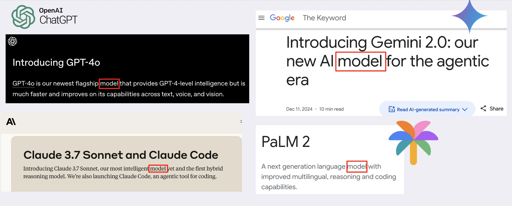
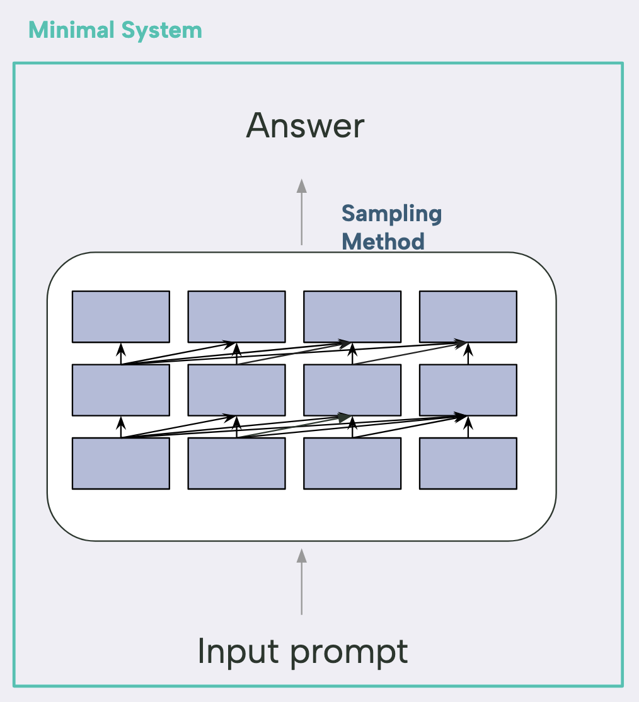
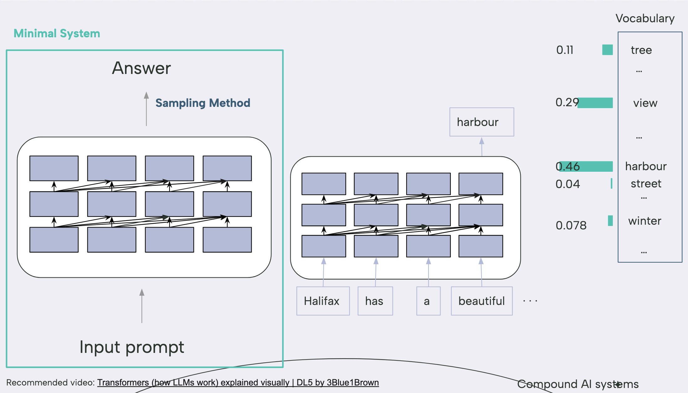
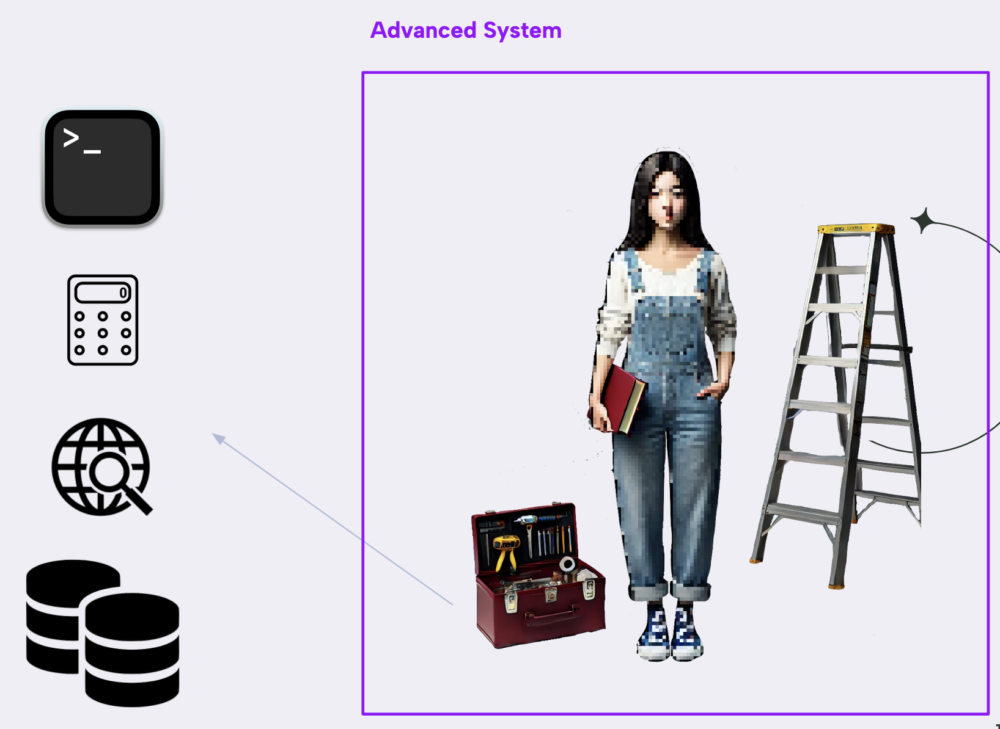
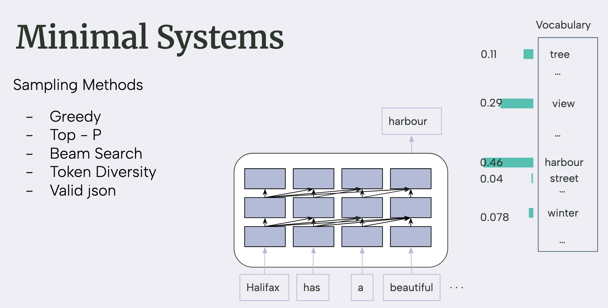
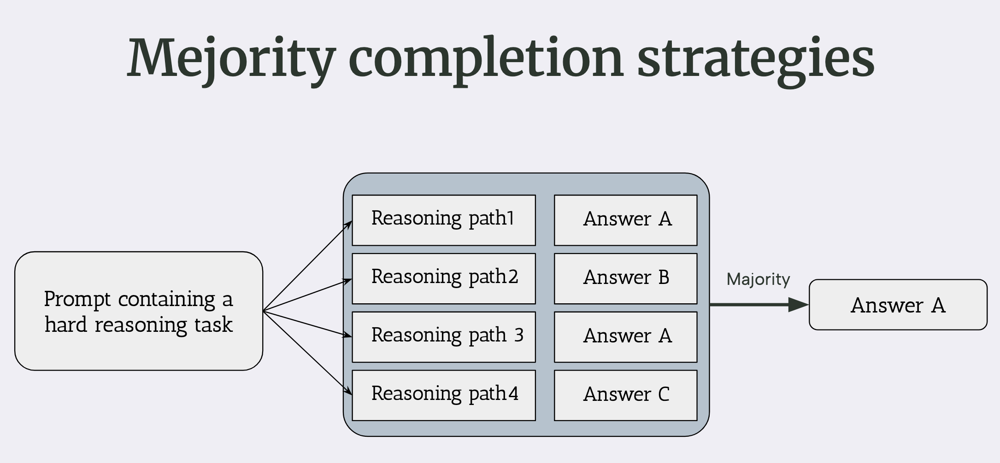
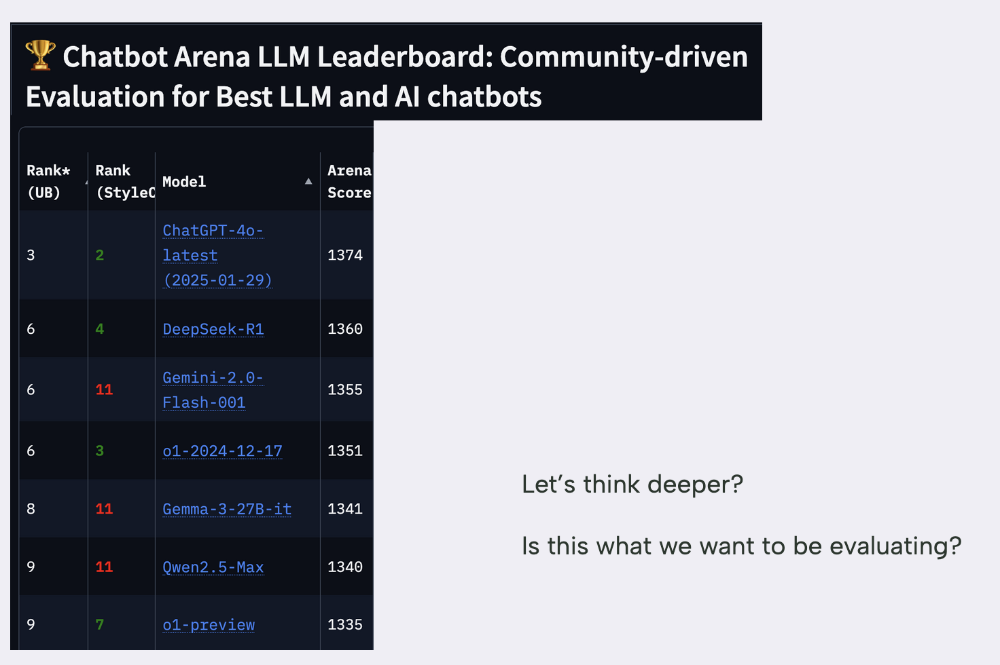
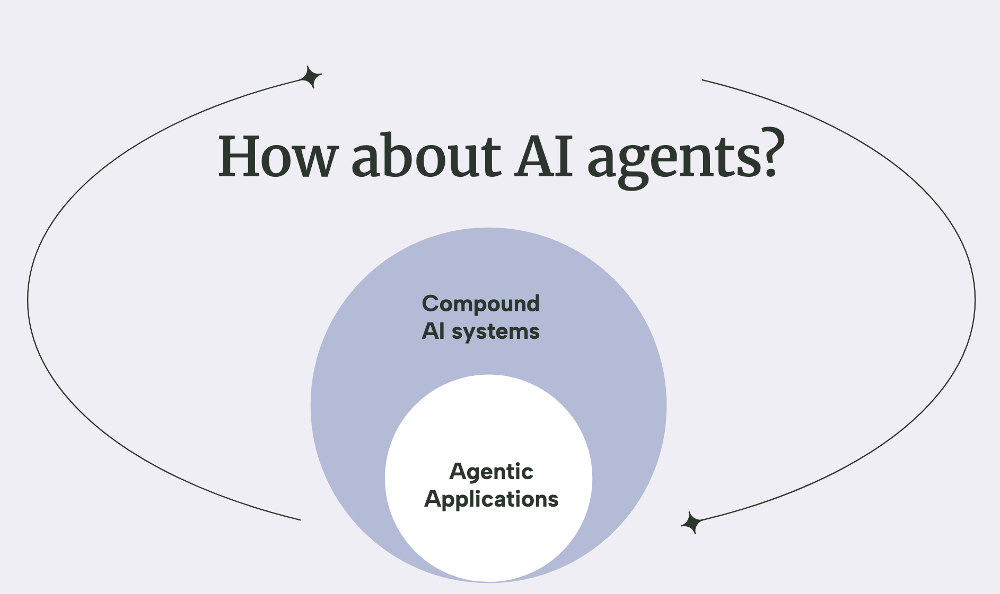

# Compound AI Systems  
*By [Fatemeh Rahimi](https://www.linkedin.com/in/fatemehrahimi/), Senior NLP Scientist at Pythonic AI*  
*Presented · March 2025 · [Halihax](https://www.halihax.com/)*  

Large Language Models (LLMs) have already reshaped how we think about artificial intelligence. Their headline-grabbing feats—fluent conversation, crisp summarization, even full-stack code generation—are remarkable. Yet the spotlight on individual models can distract us from a more important shift that's happening right now:

> We're moving from **stand-alone models** to **compound AI systems**—cohesive pipelines where multiple models, tools, and feedback loops work together to solve real-world problems end-to-end.

This post explores what compound systems look like, why they matter, and how you can start building them without losing control of complexity.

## Minimal System

Let's start with a simple question: **What *is* an AI model?**  
At its core, a model is just a function, you give it an input prompt, it generates you an output. For language models, that usually boils down to “predict the next token” over and over. Add on a sampling strategy (greedy decoding, top-p, beam search, pick your flavour) and you have what is called a **minimal system**: the bare-bones model plus just enough logic to turn predictions into fluent text.

     
### A quick toy example

Say we feed our minimal system the prompt:

> **“Halifax has a beautiful …”**

In more technical terms, the decoder emits a probability distribution over the entire vocabulary, and the sampling step (greedy, in this illustration) simply selects the token with the highest likelihood here, harbour.
> **Output:** “**…harbour!**”

You can visualise it like a bar chart where *harbour* towers over the rest. At this level, all the “intelligence” we see is just one function picking the most likely next word.

The **minimal system** is still just smart autocomplete.  
It can't pull in new facts, run live calculations, or trigger side-effects. It only generates text similar to what is has seen during the training time.

To get something *useful* we wrap the model in an **advanced system** that can reach for external tools.

Think of the **book** as everything the model already “knows”.  
The **toolbox** is runtime power—Python, a calculator, search, your private DB.  
Ask ChatGPT to *“plot a sine wave”* and it writes code, runs it, and shows the chart—that's the toolbox in action.

When you ask ChatGPT to *“plot me a sine wave”* and it generates back a chart, that's the toolbox at work: the model writes code, the system runs it, then pipes the result back to you. 

## Why systems are important?

### 1. Some tasks are solved at the **system** level  
Cranking up model size or token budgets is pricey—and it's not always the shortest path to better results.   

Scaling models is expensive and sometimes unnecessary. **AlphaCode 2** wrapped a mid-sized model in a generate-cluster-execute pipeline and leapt ~40 % in coding-competition rank without a bigger backbone.  
The *Small but Mighty AI* [report](https://tomtunguz.com/small-but-mighty-ai/) shows enterprises flocking to compact models when the surrounding **system** removes latency bottlenecks.

### 2. Systems can be **dynamic**  
Models freeze at training time; systems can fetch live data, execute code, or search the web.

### 3. Safety, control, and trust  
You can't gradient-descent your way to perfect behaviour, but you *can* add: 
* post-filters for disallowed content  
* tool routing for high-risk queries  
* confidence thresholds that summon a human  

Compound systems let us build **trustworthy** AI, not just smart AI.

## Compound-System Components  
*It starts with the prompt and ends with the answer, but the journey in between is anything but trivial.*

### 1 · Sampling matters  
Greedy, top-p, beam, diverse-beam, "valid-JSON-only"… these aren't trivial choices. Each sampling strategy can dramatically change the answer.

### 2 · Majority-of-thought  
Treat each completion as a reasoning path, then majority-vote. A cheap ensemble often beats a single call.

You can even hide this ensemble trick from users so it *looks* like one fast response.

### 3 · Prompting is the heart of system design  
Prompting is programming in natural language, tiny tweaks can swing accuracy by double-digit percentages.  
The paper [*Quantifying Language Models' Sensitivity to Spurious Features in Prompt Design*](https://arxiv.org/abs/2310.11324) by Sclar et al. reminds us that a single misplaced colon can impact the accuracy **≈ +70 %**.  

Stable prompting + robust sampling = the backbone of any compound system.

So next time you browse a leaderboard, pause for a second:

Are those scores ranking *models*, or the clever input engineering, sampling rules, and post-processing wrapped around them?  
When you benchmark your own use-case, experiment with **all** or various models, not only  just the trending model.

## Developing compound AI System in Real world

So how do we *actually* ship these systems? A few hard-won lessons:

1. **Blend disciplines**  
   * Software engineers bring modular architectures, testing, and DevOps.  
   * Research scientists bring data-driven optimisation and evaluation.  
   Systems built by both camps are the ones that last.

2. **Design interchangeable modules**  
   Generic, plug-and-play parts age better than bespoke pipelines.  
   Open-source success stories,**PyTorch** is a classic, show the power of clear layers and clean APIs.

3. **Automate, don't hand-tune**  
   Manual prompt tweaking and single-model dependence don't scale.  
   Use version-controlled prompt templates, auto-tuning frameworks (DSPy), multi-model fallbacks, and A/B tests.

### Re-thinking the toolbox

Originally we called the toolbox “code runner, calculator, web search, database.”  
In practice any deterministic service is fair game:

| Tool type      | Example use           | 
| -------------- | --------------------- | 
| **Execution**  | Python / Bash snippet | 
| **Knowledge**  | Vector search, SQL    | 
| **External API** | Weather, finance, internal micro-service | 
| **Validation** | JSON schema, regex    | 

Package each tool as a micro-service, give it a clear contract, and your LLM can invoke it safely.

## How about AI **Agent**

A particularly ambitious flavour of compound system is the **AI agent**: an LLM wired to a toolbox and empowered to take *multi-step* actions.  
Agentic apps are on trend, but they're also harder to build, tune, and evaluate—and, frankly, overkill for many problems.

* **Fixed workflow** → a simple tool chain is plenty.  
* **Planning, branching, feedback loops** → now you need an agent.

Agents are a powerful subset of compound systems—but they're harder to debug and benchmark, so reach for them only when the problem truly demands autonomous decision-making.

## Key Challenges in Compound AI Systems

Designing **system-centric** solutions yields substantial benefits, yet the path to production is rarely straightforward. The same obstacles surface in nearly every engagement.

### 1 · Retrieval-Augmented Generation (RAG)

RAG underpins most practical applications, but it introduces a large configuration space:

| Design layer      | Typical progression (simple → advanced)                                   |
|-------------------|----------------------------------------------------------------------------|
| **Retriever**     | keyword search · BM25 · dense embeddings · hybrid · LLM-generated queries |
| **Generator**     | small local model · mid-tier API · frontier model                         |
| **Retrieval boosts** | query expansion · re-ranking · hard negatives                         |
| **Answer refinement** | secondary LLM validation · tool-based fact-checking                 |

**Recommended approach**

1. Begin with the simplest viable option (e.g., keyword search).  
2. Introduce embeddings when recall plateaus.  
3. Employ LLM-generated queries or advanced rerankers only after simpler stacks are fully exploited.

### 2 · Resource Optimisation

Each additional component increases **latency** and **cost**. Choose one dimension to relax initially and refine iteratively:

| Application context       | Initial concession | Subsequent optimisation strategy            |
|---------------------------|--------------------|---------------------------------------------|
| Internal analytics tool   | higher latency     | schedule expensive steps in off-peak batches|
| Customer-facing assistant | higher cost        | reduce model size, cache frequent responses |

### 3 · Co-optimisation of Heterogeneous Modules

Compound systems combine differentiable networks and discrete tools (search, code execution, rule engines).  
End-to-end gradient descent is not available; performance improvements therefore require coordinated, heuristic tuning across modules. For example, in RAG workflows the quality of LLM-generated queries and the retriever’s hyper-parameters must be optimised jointly rather than in isolation.

---

## Operational Complexity: MLOps at the System Level

LLM agents may branch, loop, and invoke tools dynamically, complicating observability and governance. Contemporary MLOps platforms must evolve to address:

| Operational requirement | Rationale |
|-------------------------|-----------|
| **Traceable tool calls**      | Enables reproduction and debugging of multi-step executions |
| **Vector-DB lifecycle**       | Guarantees version control, warm-up, and freshness of embeddings |
| **Comprehensive monitoring**  | Centralises logs of prompts, tool outputs, and agent reflections |
| **Structured DataOps**        | Maintains clean pipelines for re-chunking and re-indexing corpora |
| **Security & compliance**     | Mitigates PII leakage, jailbreak attempts, and filter bypasses |

Compound AI systems deliver considerable value—but only when these additional engineering disciplines are addressed with equal rigour.

## Conclusion · From **Model-centric** to **System-centric** Thinking

If you remember just one thing, make it this:

> **Small, well-designed systems can beat even the biggest LLMs.**

Choosing a strong base model is only the *first* step. Real-world performance comes from the *system* wrapped around that model—dynamic, tool-aware, and safety-checked.

### Quick recommendations

| Goal | Try this first | Why |
|------|----------------|-----|
| **Prompt optimisation** | [`DSPy`](https://github.com/stanfordnlp/dspy) | Auto-tunes prompts & sampling knobs with minimal boilerplate |
| **Building agents** | LangGraph · SmolAgent · AutoGen | Each gives you structured, multi-step tool orchestration |
| **Library list** | [`llm-engineer-toolkit`](https://github.com/KalyanKS/llm-engineer-toolkit) | Curated cheatsheet of RAG, eval, and Ops utilities |

## Let's build real-world systems

Compound AI isn't a hype term; it's the next baseline for production AI.  
Whether you're shipping a chatbot, coding copilot, or medical triage assistant, *system design* is as critical as model choice.

So let's shift our mindset.  
Let's architect smarter systems.  
And let's build them together—scientists **and** engineers.

## Stay Connected

**Links:**
- [fatemerhmi.github.io/coffee-gen-ai/talks](https://fatemerhmi.github.io/coffee-gen-ai/talks)  
- [LinkedIn](https://www.linkedin.com/in/fatemehrahimi/)

## Resources

* **Stanford Webinar** - Large Language Models Get the Hype, but Compound Systems Are the Future of AI, [video](https://www.youtube.com/watch?v=vRTcE19M-KE&ab_channel=StanfordOnline)
* **The Shift from Models to Compound AI Systems**, Zaharia et al, [blog](https://bair.berkeley.edu/blog/2024/02/18/compound-ai-systems/)
* **What are compound AI systems and AI agents?** By Microsoft, [blog](https://learn.microsoft.com/en-us/azure/databricks/generative-ai/agent-framework/ai-agents)