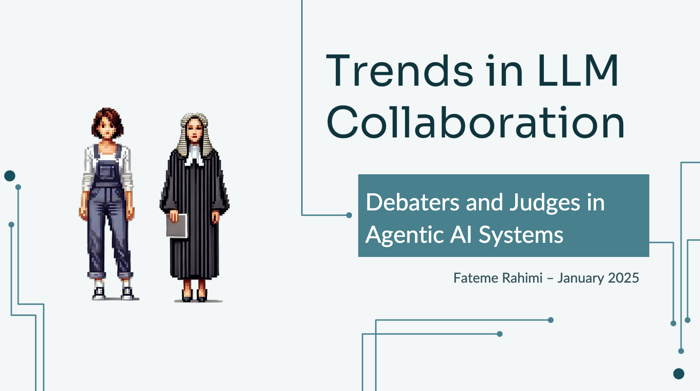
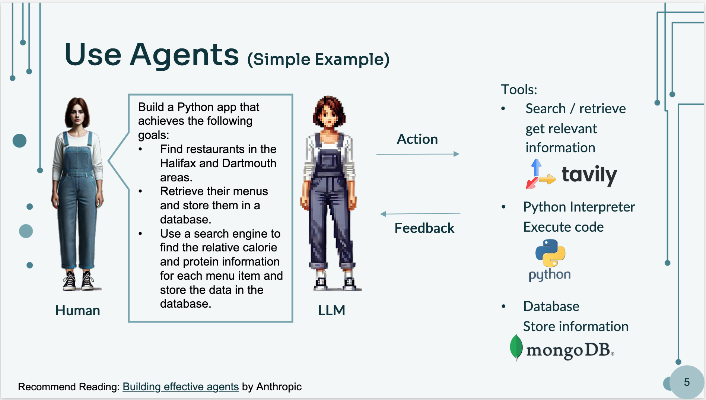
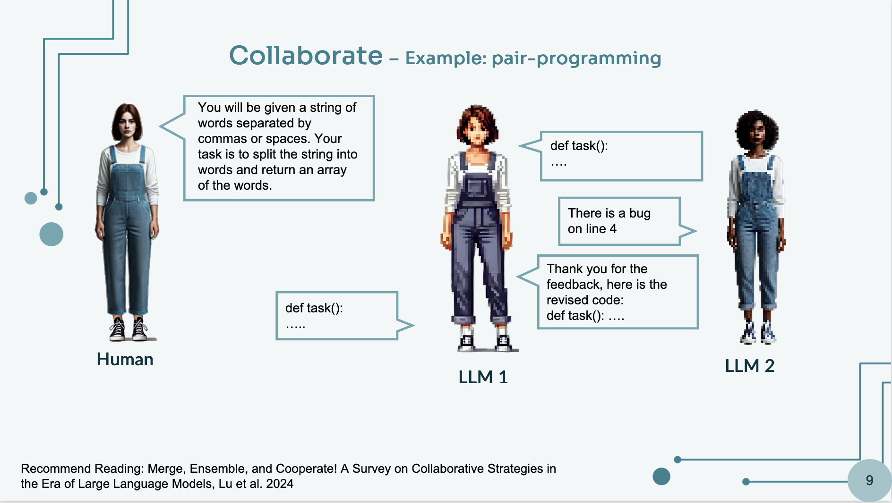
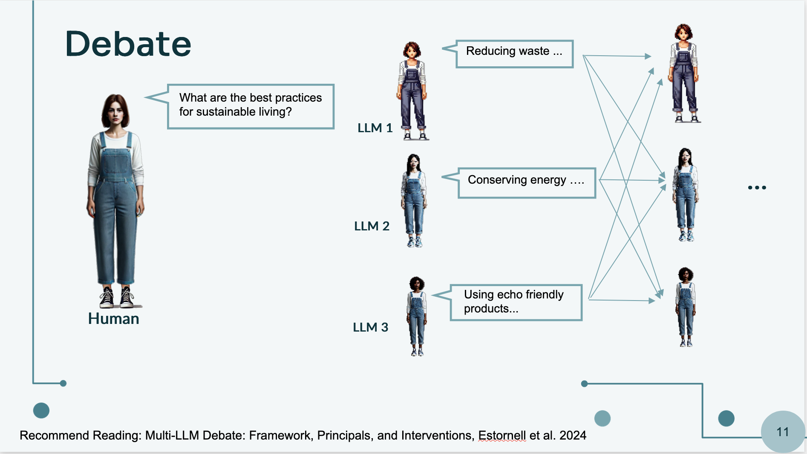
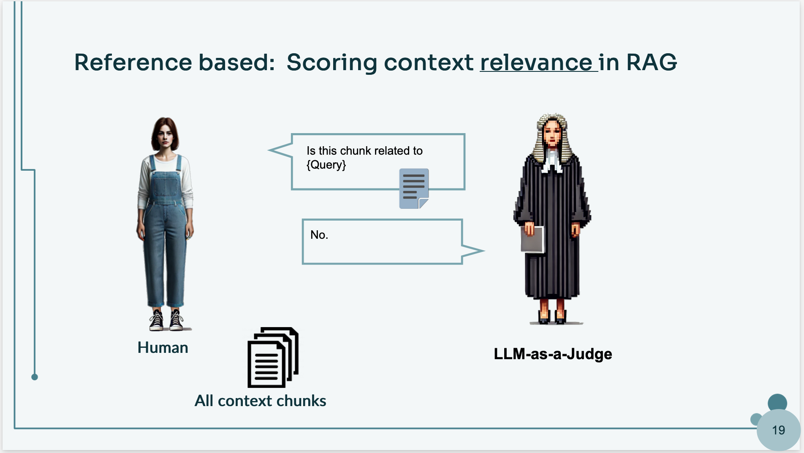

# Exploring the Latest AI Trends in LLM Collaborations

As artificial intelligence continues to evolve, large language models (LLMs) are becoming an essential part of our daily activities. Whether you're using them for content generation, coding assistance, or research, understanding the latest trends in LLM collaborations can help you unlock their full potential. In this post, we'll explore key workflows, emerging strategies, and lessons learned from working with LLMs.

## Zero-Shot Usage of LLMs
Many people interact with LLMs in a zero-shot manner, where you simply ask a question, and the model provides an answer. This straightforward interaction has become fundamental for tasks such as:
* Drafting articles, emails, and reports
* Extracting key information from documents
* Brainstorming ideas

Both open-source and proprietary models cater to specific needs, enabling users to efficiently use AI for a wide range of applications.

## LLM Workflows
Beyond zero-shot interactions, incorporating external tools can significantly enhance LLM functionality. In this setup, the model has access to APIs that allow it to interact with various applications. When solving a problem with clearly defined steps—where the output of one component directly feeds into another without uncertainty—workflows are the best approach. Anthropic explains different types of workflows in this blog post. Some common tool-augmented workflows include:
* Summarizing emails and managing schedules
* Automating data entry and document organization
* Assisting with research and fact-checking

By integrating tool access with LLM capabilities, users can create seamless workflows that optimize productivity. 

In simple words, if the problem you are solving has steps that are easily identifiable and output from one component needs to directly go to another component without uncertainty, it’s best to use workflows. Anthropic in their [building effective agents](https://www.anthropic.com/research/building-effective-agents) blog post explains some of the types of workflows. 
Agentic LLMs for Complex Tasks
For more advanced applications, agentic LLMs take automation a step further. These models function as agents capable of planning, executing, and iterating on tasks with the help of tools, such as:
* **Search tools** for gathering information
* **Python interpreters** for running code
* **Databases** for storing and retrieving data​

For example, you can see in the below picture that use LLM to write a code, decide on a plan, take action, based on the feedback revise the code until it can accomplish the project. ​

 
For example, an AI-powered coding assistant might plan a solution, write and execute the code, receive feedback(such as bugs or results from a search), and refine its approach iteratively—similar to how a human developer would tackle a problem.

## Challenges of Agentic Workflows
While agentic workflows offer powerful capabilities, they also come with limitations. Just like a single developer handling coding, testing, and deployment can become overwhelmed, a single-agent LLM may struggle with complex tasks. This is where collaborative agentic workflows come into play.

Rather than relying on a single agent to do everything, collaborative workflows distribute tasks among multiple specialized agents. Research has shown that leveraging multiple agents can lead to significant improvements in efficiency and outcomes, particularly when their communication and collaboration are well-structured. By ensuring that agents interact effectively and exchange information seamlessly, we can maximize their collective potential.

Consider a software development team:

* A developer writes code
* A test engineer verifies the functionality
* A deployment engineer ensures smooth release

This approach mirrors real-world teamwork, improving efficiency and quality. An example is [ChatDev](https://arxiv.org/abs/2307.07924), where AI agents take on roles such as CEO, CTO, and programmer to build a company collaboratively. By assigning distinct responsibilities, these agents simulate human-like team dynamics and achieve more structured results.

Knowing that using multiple agents to accomplish tasks has been explored with great results, let’s take a closer look at some of the trends that help with building these agents and especially making sure their communication and collaboration are happening most effectively and efficiently. 

# Trends in LLM collaborations
Given the potential of multi-agent collaboration, let’s examine three emerging trends of Collaboration, Debating and LLM-as-a-judge to maximize LLM result's effectiveness:

## 1. Collaboration
As much as collaboration has been proven effective in some cases, in other cases, using more than two LLMs can be even more beneficial. A question can be asked to multiple LLMs, and the response that aligns with the majority of the most similar answers could likely be the best output. In the below picture, a collaboration example is shown.

A simple example of collaboration can be when two LLMs are prompted to help each other write a code. One LLM is responsible for writing a solution, while the other is prompted to critique it, ensure it effectively solves the issue, and suggest improvements. The final result emerges from this iterative process when the reviewer LLM decides the response no longer needs further editing. This can be accomplished using simple prompting strategies, such as instructing the LLM to return responses like “completed” to break the iterative process.

In the slide, we have an example of collaboration. You ask a function and one LLM answers and the other LLM tries to find errors and make it better. Finally, when both LLMs are happy with the response, return the edited response.

## 2. Debating: Ensuring Consensus
In a debate-like scenario, multiple LLMs independently answer a question, each providing their response. These responses are then shared among the LLMs, allowing them to refine their answers through discussion and comparison. The process continues iteratively until the models reach a consensus, ultimately improving the reliability and accuracy of the final response. In the below picture, an example of this process is shown.

## 3. LLM-as-a-Judge: Evaluating Outputs
Instead of relying solely on human evaluations, one LLM can assess the responses of other models. However, since this process can be time-consuming and costly, approaches like LLM-as-a-judge offer a more efficient alternative in scenarios where bias is less likely to be an issue. Common techniques include:

* **Pairwise Comparison:** Comparing two outputs to determine the better one.
* **Evaluation by Criteria:** Assessing responses based on predefined benchmarks.
* **Reference-Free Evaluation:** Measuring output quality without relying on a reference answer.

For instance, in the next slide, you can see an evaluation with the reference-based technique that scores context relevance in RAG and can know which chunks are most related to the query.

This approach is particularly useful for chatbot evaluations, reducing reliance on costly human assessments while ensuring consistency.

# Strategies and Lessons Learned
Having experimented and built workflow and Agentic solutions for our clients, here are four key lessons we wish we had known earlier:

## 1. Start Simple
Not every problem requires Agentic AI. While they are useful, the complexity they bring isn’t always needed and can make debugging and evaluation complicated. If your problem is well-structured, a simple question-answering approach may be enough.

## 2. Experiment with different Models and Prompts
Not all LLMs perform equally across different tasks. Explore and experiment with different open and closed LLMs to find the best-suited model for your problem. Some general guidelines:
For coding: Claude, deepseek v3, deepseek R1
For writing assistance: ChatGPT.
For research-oriented tasks: Try NotebookLM.
Small variations in your prompt can greatly impact the results, make sure to gather a dataset to be able to find the most efficient evaluate your prompt, if your first prompt didn’t give you results, look at many templates online i.e. LangChain Hub. 

## 3. Build Strategically
Before jumping between different approaches, take the time to develop a clear strategy. Reading papers, even just abstracts and conclusions can provide valuable insights. 

## 4. Always Evaluate
Avoid relying solely on eyeballing when assessing model performance. Begin with simple evaluation methods, such as LLM-based judging, to ensure objective and scalable assessments. Gradually compile datasets and monitor performance across different LLM providers to determine the effectiveness of the approach.

I hope this blog post helps you to keep building amazing tools and products!

### Resources:
* [Merge, Ensemble, and Cooperate! A Survey on Collaborative Strategies in​ the Era of Large Language Models](https://arxiv.org/abs/2407.06089), Lu et al. 2024​
[LLMs-as-Judges: A Comprehensive Survey on LLM-based Evaluation Methods](https://arxiv.* org/pdf/2412.05579), Li et al, 2024
* [ChatDev: Communicative Agents for Software Development](https://arxiv.org/abs/2307.07924), Quian et al, 2024
* [Building effective agents](https://www.anthropic.com/research/building-effective-agents), Anthropic, 2024
* [Multi-LLM Debate: Framework, Principals, and Interventions](https://openreview.net/pdf?id=sy7eSEXdPC), Estornell et al. 2024​
* [Judging LLM-as-a-Judge with MT-Bench and Chatbot Arena](https://arxiv.org/abs/2306.05685), Zheng et al, 2023
